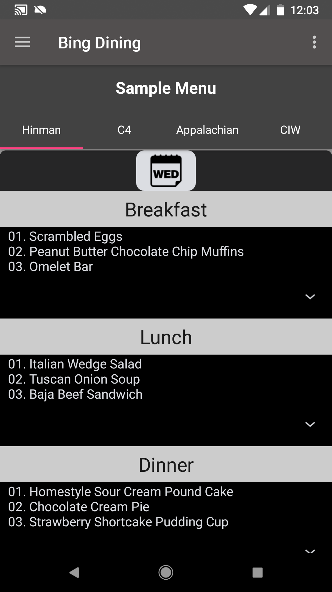
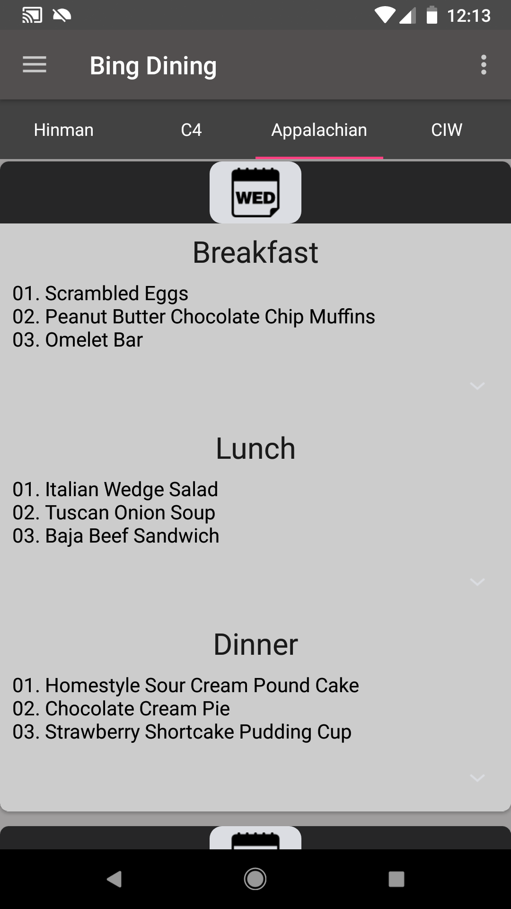

# Bing Tools
## Bing Tools presents the Binghamton campus dining menu, crypto tracker and converter, auto-launch to stop any app that prevent device from falling asleep, and a rudimentary calculator.

Bing Tools provide the following:

### a) Rudimentary calculator
	a1: Hate using touch pad to enter numbers? Bing tools lets you use the phone's keyboard to enter the numbers
	a2: Add, substract, multiply, divide any two numbers instantly
	a3: See the result in a big and clear customized textview

### b) Crypto currency rate and converter 
	b1: Instantly check how much current crypto currency rate convert to dollars
	b2: Textsize auto-sizes if result is too large to fit the view
	b3: Time stamp shown to let you know when last updated
	
### c) Binghamton campus dining menu
	c1: View the campus dining menu in an easy to read and use environment with material design. 
	    See menus from all four dining halls in one place, updated automatically.
	c2: Card view is sorted by the current day; you have the latest card shown first when opening Bing Dining.
	c3: All menu data are stored on the device via a SQLite database so https requests require only once per week; less overhead 		    and faster loading.
	c4: Settings page gives you the ability to change colors of the cards instantly. Choose any of the default colors or pick any 		    from the color picker widget.
  
### d) Navigation menu displays a new image, retrieved from Microsoft Bing homepage, daily.
  
### To be added:
	a) An about page is in works, crediting the original owners of the icons, web data, etc. (DONE)
	b) Dynamically change the colors of the cards in Bing Dining.  (DONE)
	c) Save the bitmap of the navigation image to device.

Adding new features and fixing bugs as time progresses.
