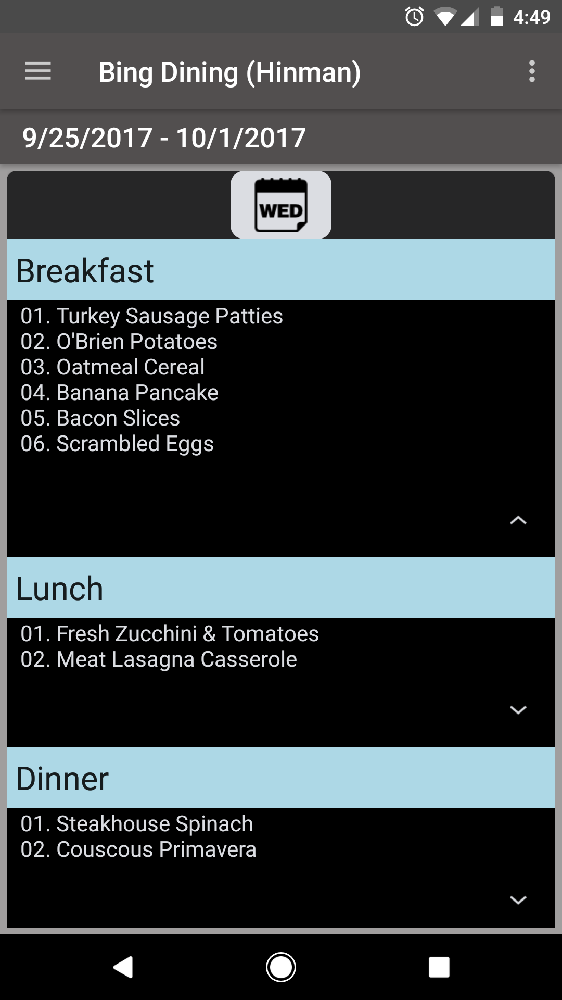

# Bing_Tools
## Bing Tools is an Android application developed using Android Studio.

Bing Tools provide the following:

### a) Rudimentary calculator

### b) Crypto currency rate and converter 

	b1: Easily check how much X ethereum convert to dollars; more crypto currency to be added soon
	b2: Time stamp shown to let you know when last updated
	b3: Data saved on device while app is running; requires fewer https requests
  
### c) Binghamton campus dining menu

	c1: Present the campus dining menu in an easy to read and use enviornment via recylerview and cards with material design. 
	    Currently only Hinman dining hall is avaliable, more to follow.
	c2: Sort the cards view in relation to the current day; you have the latest card shown first when opening Bing Dining.
	    No longer will you need to swipe/scroll down to see what's on menu for today.
	c3: Menu data is stored on the device at first launch so https requests require only once per week;less overhead/faster loading.
	c4: Settings page now gives you the ability to change colors of the cards; requires a refresh of the activity. 
	    You can change the colors of the expandable text as well as the meal time bar. More colors to be added soon.
	c5: Added the ability to reset to default colors
  
### d) Navigation menu displays a new image everyday thanks to Microsoft Bing.
  
### To be added:
	a) An about page is in works, crediting the original owners of the icons, web data, etc.
	b) Dynamically change the colors of the cards in Bing Dining.
	c) Save the bitmap of the navigation image to device. 

Adding new and cool stuff as time progresses.
